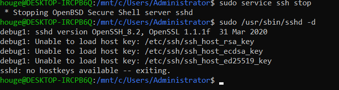
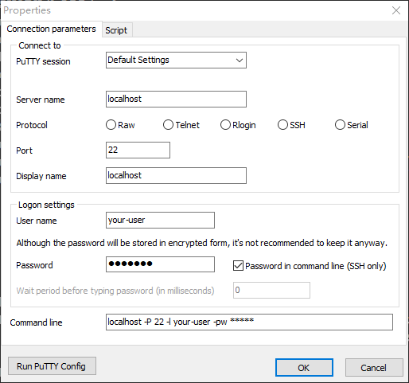

# Use ssh for WSL on windows 10

## What is WSL？

https://docs.microsoft.com/en-us/windows/wsl/about

## Install

please make sure your windows 10 is enterprise version，how to install it please refer this guide:

https://docs.microsoft.com/en-us/windows/wsl/install-win10

## Install and start ssh server

If you have used to Linux terminal tools such as xshell and MTPuTTY, then I think you can't accept the default terminal provided by WSL ubuntu or other version.

It will let you use ssh via xshell or putty to login to the WSL when you start ssh server on WSL linux.

if you can't start sshd use below command, then you need re-install the openssh-server.



Use below command to re-install openssh-server

```
$ sudo apt purge openssh-server
$ sudo apt install openssh-server
```

Then you need configure these parameters in sshd configuration file /etc/ssh/sshd_config.

```
#edit these parameter to below value
sudo vi /etc/ssh/sshd_config
Port 22
# 这两行允许了 root 账户和密码登录
PermitRootLogin yes
PasswordAuthentication yes
```

Then start the sshd

```
sudo /usr/sbin/sshd -d
```

After start sshd successfully, you could use xshell or putty to login to WSL via localhost.



## some issues

### need create the dir /run/sshd

Please make sure this directory is exist when you start sshd, if not. start sshd will be failed, you could add -d  parameter to check detail errors.
